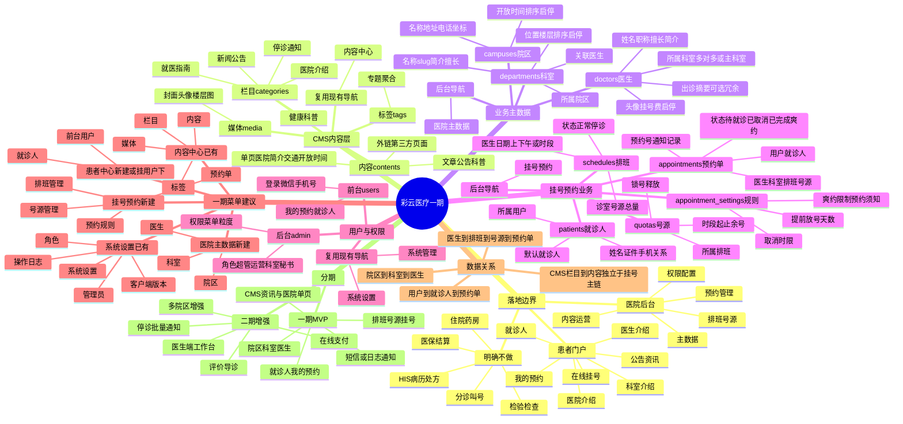

# 彩云医疗 · 一期模块拆分脑图

> 基于当前 CMS 基座（栏目 / 内容 / 标签 / 媒体 + Filament 后台导航）拆解。  
> **原则**：能走 CMS 内容/栏目的不另建业务表；需要结构化查询、外键关联、状态流转的必须建业务表。

在支持 Mermaid 的编辑器（如 VS Code / Cursor Markdown 预览、GitHub）中可直接渲染下方脑图。



---

## 1. 拆分结论一览

| 模块 | 落地方式 | 说明 |
|------|----------|------|
| 医院介绍 / 就医指南 | **CMS** | `contents` 单页 + 栏目 |
| 新闻公告 / 健康科普 / 停诊公告文案 | **CMS** | `contents` 文章 + 栏目/标签 |
| 轮播 / 封面图 | **CMS 媒体 + 内容封面** | 或系统设置存 Banner 列表（二期再独立） |
| 院区 | **业务表** `campuses` | 挂号与科室挂载需要结构化主数据 |
| 科室介绍 | **业务表** `departments` | 含简介正文；列表/详情/按院区筛选需外键 |
| 医生介绍 | **业务表** `doctors` | 含简介；必须关联科室、排班、挂号费 |
| 排班 / 号源 / 预约单 / 就诊人 / 预约规则 | **业务表** | 状态机与库存，不能塞进 CMS 文章 |
| 前台用户登录 | **已有** `users` + 微信/手机能力 | 见现有认证与第三方账号文档 |
| 管理员 / 角色 / 权限 / 操作日志 | **已有** | Filament 系统设置 / 系统管理 |

> **科室、医生为什么不直接用 CMS 内容？**  
> 介绍文案虽像「文章」，但挂号链路需要稳定外键、启停、挂号费、排班关联与高频结构化查询。CMS `contents` 适合运营文案，不适合当挂号主数据。科室/医生表自带 `summary`/`body`/`cover` 即可满足「介绍」；若要做 SEO 长文，可再可选关联一篇 CMS 内容。

---

## 2. CMS 层（走栏目 + 内容）

### 建议预置栏目（`categories`）

| 栏目 slug 建议 | 用途 | 内容类型 |
|----------------|------|----------|
| `hospital` | 医院介绍（简介、交通、开放时间等单页） | `page` |
| `notices` | 新闻公告 | `article` |
| `suspensions` | 停诊/就诊须知类公告（文案通知） | `article` |
| `health` | 健康科普 | `article` |
| `guide` | 就医指南（就诊流程、预约须知长文） | `page` / `article` |

### 仍用现有后台菜单（内容中心）

- 内容
- 栏目
- 标签
- 媒体

公开 API 继续复用：`/api/cms/categories`、`/api/cms/contents`、`/api/cms/contents/{slug}`。

---

## 3. 业务表层（必须新建）

### 3.1 医院主数据

```
campuses（院区）
  └─ departments（科室）
        └─ doctors（医生）  ← 建议 doctor_department 中间表，支持多科室
```

**关键字段草案**

| 表 | 关键字段 |
|----|----------|
| `campuses` | name, slug, address, phone, latitude/longitude, open_hours, sort, is_enabled |
| `departments` | campus_id, name, slug, summary, body, cover, location, sort, is_enabled |
| `doctors` | name, slug, title(职称), specialties(擅长), summary, body, avatar, fee, sort, is_enabled |
| `doctor_department` | doctor_id, department_id, is_primary |

### 3.2 挂号预约

```
doctors
  └─ schedules（排班：医生 + 日期 + 午别/时段模板）
        └─ quotas / slots（号源：时段 + 总量/余号）
              └─ appointments（预约单）
patients（就诊人，归属 users）
appointment_settings（规则，可用 system_settings 键值或独立表）
```

**预约单状态建议**：`pending`（待就诊）→ `completed` / `cancelled` / `no_show`（爽约）；排班可另有 `normal` / `suspended`（停诊）。

### 3.3 与 CMS 的边界

| 场景 | 建议 |
|------|------|
| 科室/医生详情页文案 | 读业务表 `summary`/`body` |
| 「我院心内科开展新技术」新闻 | CMS 文章，正文里口头提及科室即可 |
| 某日某医生停诊公告 | 业务上改排班状态 + 可选发一篇 CMS 停诊公告 |
| 预约须知弹窗短文案 | `appointment_settings`；长文放到 CMS「就医指南」 |

---

## 4. 后台菜单（Filament NavigationGroup）建议

| 导航分组 | 菜单项 | 来源 |
|----------|--------|------|
| **内容中心** | 内容、栏目、标签、媒体 | 已有 |
| **医院主数据** | 院区、科室、医生 | 新建 |
| **挂号预约** | 排班管理、号源管理、预约单、预约规则 | 新建 |
| **患者中心** | 前台用户、就诊人 | 用户资源可迁入此组；就诊人新建 |
| **系统设置** | 管理员、角色、系统设置、客户端版本 | 已有 |
| **系统管理** | 操作日志 | 已有 |

权限建议按资源拆：`campuses.*`、`departments.*`、`doctors.*`、`schedules.*`、`appointments.*`、`patients.*`，与现有 `contents.*` 风格一致。

---

## 5. 患者端页面 / API 映射（一期）

| 能力 | 数据来源 | 接口方向 |
|------|----------|----------|
| 医院介绍 | CMS 单页 | 已有 CMS 公开 API |
| 公告/科普列表详情 | CMS | 已有 CMS 公开 API |
| 科室列表/详情 | `departments` | 新建 Hospital API |
| 医生列表/详情 | `doctors` | 新建 Hospital API |
| 可挂号码源日历 | `schedules` + `quotas` | 新建 Appointment API |
| 提交挂号 | `appointments` + 锁号 | 新建（需登录） |
| 我的预约 / 取消 | `appointments` | 新建（需登录） |
| 就诊人 CRUD | `patients` | 新建（需登录） |

---

## 6. 一期 / 二期边界

**一期 MVP**

1. CMS：医院单页 + 公告/科普栏目内容运营  
2. 院区、科室、医生主数据与介绍页  
3. 排班、号源、在线挂号、我的预约、取消规则  
4. 就诊人管理  
5. 通知先走 `SMS_DRIVER=log` / 邮件 log，联调后再接真实短信  

**二期**

- 支付、停诊批量通知、评价、智能导诊、医生端工作台、统计报表、Banner 独立配置  

**不做（避免做成伪 HIS）**

- 电子病历、医嘱处方、医保、检验检查、住院、药房、分诊叫号、与院内 HIS 深度结算对接  

---

## 7. 推荐实施顺序

1. 预置 CMS 栏目 + 医院介绍单页（零业务表即可见门户雏形）  
2. `campuses` → `departments` → `doctors`（介绍页可先上线）  
3. `schedules` + `quotas`（放号）  
4. `patients` + `appointments`（闭环挂号）  
5. 预约规则与通知  
6. 权限菜单与角色（运营 / 科室秘书）  

---

## 附录：纯文本脑图（无 Mermaid 时亦可阅读）

```
彩云医疗一期
├─ CMS 内容层（内容中心）
│  ├─ 栏目：医院介绍 / 新闻公告 / 停诊通知 / 健康科普 / 就医指南
│  ├─ 内容：单页、文章、外链
│  ├─ 标签、媒体
│  └─ 不承担挂号外键
├─ 业务主数据（医院主数据）
│  ├─ 院区 campuses
│  ├─ 科室 departments（含介绍）
│  └─ 医生 doctors（含介绍）
├─ 挂号预约
│  ├─ 排班 schedules
│  ├─ 号源 quotas
│  ├─ 预约单 appointments
│  ├─ 就诊人 patients
│  └─ 预约规则 settings
├─ 用户与权限
│  ├─ 前台 users（已有）
│  └─ 后台 admin / roles（已有）
└─ 分期
   ├─ 一期：介绍 + 挂号闭环
   └─ 二期：支付 / 通知增强 / 评价导诊
```
